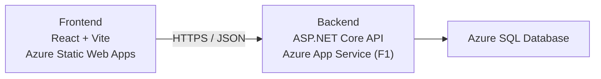

# API de Gestión de Inventario

> **Idiomas:** [English](README.MD) | [Español](README.es.md)

Este proyecto es una aplicación web que permite a los usuarios consultar y gestionar artículos de inventario. El sistema incluye soporte para paginación, filtrado y ordenamiento de los artículos para mejorar la usabilidad. También incluye una interfaz fácil de usar para gestionar el inventario e interactuar con la API del backend.

La API permite realizar operaciones CRUD sobre los artículos del inventario, incluyendo obtener todos los artículos, obtener un artículo por ID, crear nuevos artículos, actualizar artículos existentes y eliminar artículos.

## Demostración en vivo

 - **Aplicación:** https://icy-tree-0dc80d31e.7.azurestaticapps.net/
 - **API:** https://inv-man-b0gfatatf7h0bkc4.westus3-01.azurewebsites.net

  > Alojado en Azure: frontend de React en Azure Static Web Apps, backend de .NET en Azure App Service (F1) y Azure SQL Database.
  > El backend puede tardar unos segundos en responder en la primera carga.

## Tabla de contenidos

- [Características](#características)
- [Tecnologías utilizadas](#tecnologías-utilizadas)
- [Arquitectura](#arquitectura)
- [Desarrollo local](#desarrollo-local)
- [Requisitos previos](#requisitos-previos)
- [Inicio rápido (Docker)](#inicio-rápido-docker)
- [Instalación](#instalación)
- [Configuración de la base de datos](#configuración-de-la-base-de-datos)
- [Ejecutar la aplicación](#ejecutar-la-aplicación)
- [Documentación de la API](#documentación-de-la-api)
- [Ejecutar las pruebas unitarias](#ejecutar-las-pruebas-unitarias)
- [Implementación (nivel gratuito)](#implementación-nivel-gratuito)

## Características

- Obtener todos los artículos del inventario con soporte de paginación.
- Obtener un artículo específico por su ID único.
- Agregar nuevos artículos a la base de datos.
- Actualizar artículos existentes.
- Eliminar artículos de la base de datos.
- Registro e inicio de sesión de usuarios con autenticación JWT.
- Las operaciones de escritura (crear, actualizar, eliminar) están protegidas y requieren un token válido.
- Retroalimentación en tiempo real mediante snackbars para las acciones del usuario.

## Tecnologías utilizadas

### Backend

- **ASP.NET Core**: para construir la API web.
- **Entity Framework Core**: para interactuar con la base de datos.
- **ASP.NET Core Identity**: para la gestión de usuarios y el hash de contraseñas.
- **JWT (JwtBearer)**: para emitir y validar los tokens de autenticación.
- **xUnit**: para las pruebas unitarias.
- **Moq**: para simular dependencias en las pruebas.
- **SQL Server**: para la gestión de la base de datos.
- **Swagger**: para la documentación de la API.

### Frontend

- **React**: librería de JavaScript para construir interfaces.
- **Material-UI**: librería de componentes para interfaces responsivas y accesibles.
- **Axios**: para realizar las peticiones HTTP a la API del backend.
- **TypeScript**: para la seguridad de tipos en el código del frontend.
- **Vite**: para el empaquetado y el servidor de desarrollo.
- **Tailwind CSS**: para los estilos.
- **Vitest + React Testing Library**: para las pruebas unitarias y de integración del frontend.

## Arquitectura

La aplicación sigue una arquitectura de tres capas alojada por completo en Azure:

- **Frontend (Azure Static Web Apps):** una aplicación de página única (SPA) en React creada con Vite. Consume la API de inventario.
- **Backend (Azure App Service, .NET 8, nivel gratuito F1):** una API web de ASP.NET Core que expone los endpoints REST, aplica las migraciones de Entity Framework Core y gestiona la autenticación JWT.
- **Base de datos (Azure SQL Database):** una base de datos relacional que almacena los artículos del inventario y las cuentas de usuario gestionadas mediante ASP.NET Core Identity.



## Desarrollo local

Para el desarrollo local, se utiliza una instancia local de SQL Server mediante Docker, de modo que no necesita instalar SQL Server directamente.

1. Inicie el contenedor de SQL Server con `docker compose up -d`. El archivo `docker-compose.yml` en la raíz del repositorio ejecuta SQL Server 2022 con la cadena de conexión ya configurada en `appsettings.json`.
2. Ejecute el backend desde la carpeta `backend` con `dotnet run`. Las migraciones pendientes se aplican y los datos de ejemplo se agregan automáticamente en el primer inicio.
3. Ejecute el frontend desde la carpeta `frontend` con `npm run dev`. Por defecto apunta a `http://localhost:5147/api`.

## Requisitos previos

Antes de comenzar, asegúrese de tener instalado lo siguiente:

- [Docker](https://www.docker.com/) (recomendado). Es la forma más sencilla de ejecutar SQL Server mediante `docker compose`.
- [SDK de .NET 8](https://dotnet.microsoft.com/download/dotnet/8.0). El repositorio fija esta versión mediante `global.json`, así que los comandos `dotnet` la usan automáticamente.
- [Node.js](https://nodejs.org/) (para el frontend)

No se requiere una instancia existente de SQL Server: el `docker-compose.yml` incluido ejecuta SQL Server 2022 localmente. Si ya tiene su propio SQL Server, puede usarlo en su lugar (ver [Instalación](#instalación)).

## Inicio rápido (Docker)

```bash
# 1. Inicie SQL Server 2022 (contraseña SA por defecto: Inventory!Dev123)
docker compose up -d

# 2. Backend: ejecute (las migraciones se aplican y los datos de ejemplo se agregan automáticamente en el primer inicio)
cd backend
dotnet run

# 3. Frontend: instale y ejecute (por defecto apunta a http://localhost:5147/api)
cd ../frontend
npm install
npm run dev
```

## Instalación

1.  Clone el repositorio:

    ```bash
    git clone https://github.com/andcb/inventory-management-api.git
    ```

2.  Configure el backend:

    - Vaya a la carpeta del backend

      ```bash
      cd backend
      ```

    - Restaure los paquetes NuGet

      ```bash
      dotnet restore
      ```

    - Inicie SQL Server mediante Docker (la cadena de conexión en `appsettings.json` ya apunta a esta instancia):

      ```bash
      docker compose up -d
      ```

    - Ejecute el proyecto (las migraciones pendientes se aplican y los datos de ejemplo se agregan automáticamente en el primer inicio)

      ```bash
      dotnet run
      ```

    - (Opcional) Aplique las migraciones manualmente en su lugar:

      ```bash
      dotnet ef database update
      ```

    - Compilar el proyecto

      ```bash
      dotnet build
      ```

    Si quiere usar su propia instancia de SQL Server, puede sobrescribir la cadena de conexión con una variable de entorno:

    ```bash
    export ConnectionStrings__DefaultConnection="Server=su-servidor;Database=Inventory;User Id=su-usuario;Password=su-contraseña;TrustServerCertificate=True"
    ```

3.  Configuración del frontend:

    - Vaya a la carpeta del frontend

      ```bash
      cd ../frontend
      ```

    - Instale los paquetes npm

      ```bash
      npm install
      ```

    - No se requiere ningún archivo de entorno: el frontend apunta a `http://localhost:5147/api` por defecto. Para cambiarlo, puede crear un archivo `.env.local` con la dirección:

      ```bash
      VITE_API_URL=http://direccion-de-api/api
      ```

## Configuración de la base de datos

La aplicación agrega los datos de ejemplo automáticamente al iniciar cuando la tabla `InventoryItems` está vacía, por lo que una base de datos nueva comienza con contenido de demostración sin necesidad de SQL manual.

Si no quiere usar las migraciones de EntityFramework, también puede crear la base de datos manualmente:

```sql
  CREATE TABLE [InventoryItems] (
       [Id] int NOT NULL IDENTITY,
       [Name] nvarchar(max) NOT NULL,
       [Quantity] int NOT NULL,
       [Price] decimal(10,2) NOT NULL,
       CONSTRAINT [PK_InventoryItems] PRIMARY KEY ([Id])
   );
```

También puede usar los siguientes datos para poblar la base de datos:

<details>

```sql
INSERT INTO [InventoryItems] ([Name], [Quantity], [Price])
VALUES
('Apple MacBook Pro 16"', 50, 2399.99),
('Samsung Galaxy S21', 120, 799.99),
('Sony WH-1000XM4 Headphones', 75, 349.99),
('Dell XPS 13', 80, 1299.99),
('HP Spectre x360', 60, 1399.99),
('Google Pixel 5', 90, 699.99),
('Microsoft Surface Pro 7', 40, 899.99),
('Fitbit Versa 3', 100, 229.99),
('Logitech MX Master 3 Mouse', 110, 99.99),
('Amazon Echo Dot (4th Gen)', 150, 49.99),
('Nikon D3500 Camera', 30, 499.99),
('Canon EOS Rebel T7', 25, 449.99),
('iPad Pro 11"', 65, 799.99),
('Samsung Galaxy Tab S7', 55, 649.99),
('Razer Blade 15 Gaming Laptop', 20, 2499.99),
('Asus ROG Zephyrus G14', 15, 1799.99),
('Bose SoundLink Revolve', 45, 199.99),
('GoPro HERO9 Black', 35, 399.99),
('Anker PowerCore 10000', 200, 29.99),
('Sony A7 III Camera', 10, 1999.99),
('DJI Mavic Air 2', 18, 799.99),
('Oculus Quest 2', 25, 299.99),
('HP Omen 15 Gaming Laptop', 22, 1399.99),
('Apple AirPods Pro', 150, 249.99),
('Microsoft Xbox Series X', 30, 499.99),
('Sony PlayStation 5', 20, 499.99),
('Nintendo Switch', 40, 299.99),
('iPhone 12', 75, 999.99),
('Samsung 970 EVO SSD 1TB', 50, 149.99),
('Western Digital My Passport 2TB', 65, 89.99),
('Seagate Backup Plus 4TB', 45, 99.99),
('Lenovo ThinkPad X1 Carbon', 25, 1699.99),
('Acer Aspire 5', 55, 549.99),
('LG OLED55CXPUA TV', 15, 1399.99),
('Vizio 55-Inch 4K Smart TV', 30, 649.99),
('Samsung Galaxy Buds+', 80, 149.99),
('Bose QuietComfort 35 II', 20, 299.99),
('HP Envy 13', 45, 999.99),
('Apple Watch Series 6', 65, 399.99),
('Fitbit Charge 4', 100, 149.99),
('Roku Streaming Stick 4K', 150, 49.99),
('Google Nest Hub', 70, 99.99),
('Philips Hue White LED Smart Bulb', 200, 14.99),
('Keurig K-Elite Coffee Maker', 50, 129.99),
('Instant Pot Duo 7-in-1', 80, 89.99),
('KitchenAid Stand Mixer', 20, 349.99),
('Nespresso Vertuo Coffee Maker', 30, 199.99),
('Dyson V11 Torque Drive', 25, 599.99),
('Shark Navigator Lift-Away', 45, 199.99),
('iRobot Roomba 675', 35, 299.99),
('Breville Smart Oven', 15, 199.99),
('Cuisinart 14-Cup Food Processor', 18, 199.99),
('Hamilton Beach Slow Cooker', 50, 49.99),
('Vitamix 5200 Blender', 20, 449.99),
('Black+Decker 20V Max Drill', 55, 79.99),
('Makita 18V LXT Circular Saw', 30, 149.99),
('DeWalt 20V Max Lithium-Ion Cordless Combo Kit', 25, 349.99),
('Craftsman 20-Piece Socket Set', 50, 89.99),
('Ryobi 18V Cordless Drill', 40, 99.99),
('Milwaukee M18 Fuel 1/2" Hammer Drill', 22, 199.99),
('Stanley 77-Piece Mechanics Tool Set', 35, 159.99),
('Dremel 4300 Rotary Tool Kit', 30, 199.99),
('Greenworks 20-Inch Cordless Lawn Mower', 18, 349.99),
('Sun Joe Electric Pressure Washer', 20, 159.99),
('Toro 22-Inch Recycler Mower', 25, 299.99),
('Black+Decker Electric Leaf Blower', 40, 99.99),
('Coleman Portable Camping Chair', 100, 39.99),
('REI Co-op Flash 22 Pack', 80, 59.99),
('YETI Rambler 20 oz Tumbler', 150, 29.99),
('LifeStraw Personal Water Filter', 200, 19.99),
('Patagonia Black Hole Duffel Bag', 30, 129.99),
('Columbia Bugaboo II Fleece Interchange Jacket', 25, 89.99),
('The North Face Recon Backpack', 20, 99.99);
```
</details>

## Ejecutar la aplicación

Para ejecutar la aplicación localmente, use los siguientes comandos:

- backend
  ```bash
  dotnet run
  ```
- frontend
  ```bash
  npm run dev
  ```

## Documentación de la API

El proyecto usa Swagger para documentar la API.

1.  Inicie la API ejecutando `dotnet run` desde la carpeta `backend`.
2.  Vaya a `http://localhost:PUERTO/swagger` para explorar e interactuar con la API.
3.  La interfaz de Swagger incluye un botón **Authorize** donde puede pegar el JWT devuelto por los endpoints `/api/auth/login` o `/api/auth/register`.

### Autenticación

| Endpoint | Método | Descripción |
| --- | --- | --- |
| `/api/auth/register` | POST | Registra una cuenta nueva. Cuerpo: `{ "username": "...", "password": "..." }` |
| `/api/auth/login` | POST | Inicia sesión y devuelve un JWT. Cuerpo: `{ "username": "...", "password": "..." }` |

Ambos endpoints devuelven `{ "token": "<jwt>", "username": "..." }`. El token expira después de 24 horas.

Los endpoints `GET` del inventario son públicos. Crear, actualizar y eliminar artículos requiere un JWT válido enviado en el encabezado `Authorization: Bearer <token>`.

La clave de firma del JWT, el emisor y la audiencia se configuran en la sección `JWT` de `appsettings.json`. **Cambie la `Key` por un secreto fuerte y único antes de desplegar.**

## Ejecutar las pruebas unitarias

### Backend

Las pruebas del backend usan xUnit y Moq para simular las dependencias del repositorio. Para ejecutarlas:

1.  Vaya a la carpeta `backendTests`:

```bash
cd backendTests
```

2.  Ejecute las pruebas unitarias:

```bash
dotnet test
```

Las pruebas cubren los endpoints del `InventoryController` y también el flujo de autenticación:

- Obtener todos los artículos
- Obtener un artículo por ID
- Crear nuevos artículos
- Actualizar artículos
- Eliminar artículos
- Registrar una cuenta nueva y recibir un JWT
- Rechazar nombres de usuario duplicados y contraseñas débiles
- Iniciar sesión con credenciales válidas e inválidas
- Generar JWTs con los claims, la expiración y la firma correctos

### Frontend

Las pruebas del frontend usan Vitest con React Testing Library y simulan la capa de API para que los componentes y hooks se ejecuten con datos deterministas. Para ejecutarlas:

```bash
cd frontend
npm test
```

Las pruebas cubren:

- Los formularios de inicio de sesión y registro (validación, contraseñas que no coinciden, snackbars de error).
- El flujo completo de autenticación: estado sin sesión, inicio de sesión y registro que cambian a la vista de inventario, e inicios de sesión fallidos que permanecen en la página de autenticación.
- Las interacciones del inventario: renderizado, estado vacío, filtrado con debounce y reinicio de página, y confirmación de eliminación.
- El hook `useInventory`: parámetros de las peticiones, tiempos del debounce y reinicios de página.

Para más información, consulte la documentación oficial de xunit en [https://xunit.net/]
